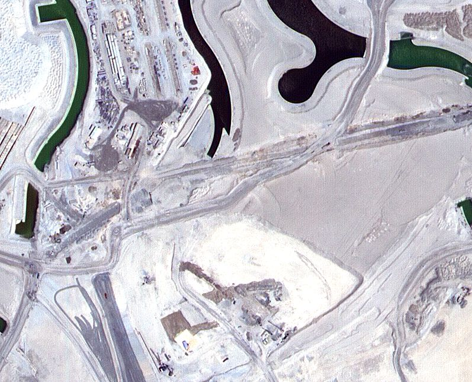
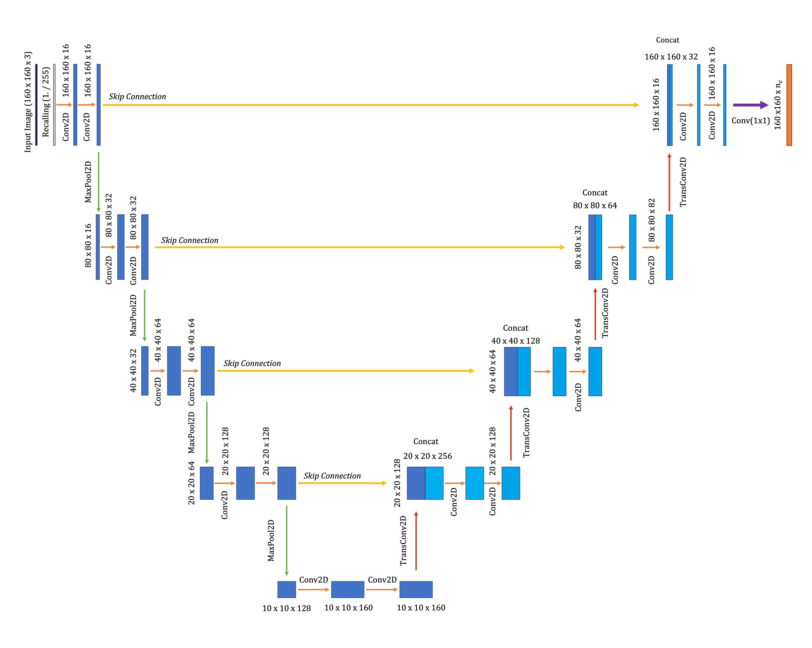

# u-net-aerial-imagery-segmentation

This repository accompanies this [Medium Article](https://medium.com/towards-data-science/semantic-segmentation-of-aerial-imagery-using-u-net-in-python-552705238514
)
https://medium.com/@andrewdaviesul/membership

The project aims to provide an implementation of a Tensorflow U-Net model for the semantic segmentation of aerial imagery.

Photo by ZQ Lee on Unsplash

## Dataset

The MBRSC dataset exists under the CC0 license, available to download. It consists of aerial imagery of Dubai obtained by MBRSC satellites and annotated with pixel-wise semantic segmentation in 6 classes.

Training Data Image                               |  Training Data Mask
:------------------------------------------------:|:-----------------------------------------------------:
 |  

## Model

A simple U-Net model is used for the semantic segmentation. The model architecture is illustrated below.
U-Net consists of two critical paths: 1) Contraction 2) Expansion

Filters in the expansive path contain high level spatial and contextual feature information.
Detailed fine-grained structural information contained in the contraction path.

## Prediction

Below is a visualisation of ten outputs portraying the patched aerial image of Dubai, the ground truth mask and the U-Net segmentation prediction.

